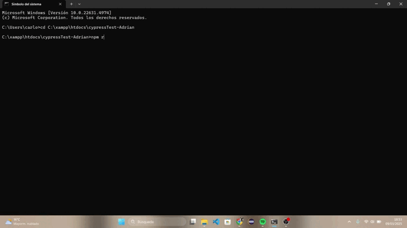

# Formulario de Registro Moderno con Validaciones y Tests Cypress

Este proyecto implementa un formulario de registro de usuario con interfaz moderna y validaciones completas, tanto del lado del cliente como mediante pruebas automatizadas con Cypress. El sistema incluye validación de campos, seguridad de contraseñas, y una página de confirmación con diseño atractivo que muestra la información del usuario registrado.



## Características

### Formulario de Registro
- **Campos obligatorios**:
  - Nombre completo
  - Correo electrónico (con validación de formato)
  - Contraseña (con requisitos de seguridad)
  - Confirmación de contraseña
  - Aceptación de términos y condiciones
- **Campos opcionales**:
  - Fecha de nacimiento
- **Validaciones en tiempo real**:
  - Errores específicos para cada tipo de validación
  - Habilitación/deshabilitación automática del botón de envío
  - Verificación de coincidencia de contraseñas
- **Diseño mejorado**:
  - Interfaz moderna con secciones claras
  - Mejor experiencia de usuario
  - Elementos visuales indicativos del estado

### Página de Confirmación
- Mensaje de bienvenida personalizado
- Diseño visual atractivo con tarjeta de información
- Resumen de la información registrada (sin mostrar la contraseña)
- Opciones para navegar al inicio o continuar al área de usuario

### Tests Automatizados con Cypress
- Validación de carga correcta del formulario
- Verificación de campos obligatorios
- Pruebas de formato y validación de correo electrónico
- Verificación de requisitos de seguridad de contraseña
- Pruebas de flujo completo de registro
- Manejo de casos límite
- Validación de la navegación a la página de confirmación

## Estructura del Proyecto

```
├── registro.html       # Página principal con el formulario de registro
├── confirmacion.html   # Página de confirmación tras registro exitoso
├── styles.css          # Estilos CSS modernos para ambas páginas
├── script.js           # Lógica JavaScript para validaciones
├── cypress/            # Directorio de pruebas Cypress
│   └── e2e/            # Tests end-to-end
│       └── form.cy.js  # Tests del formulario de registro
├── cypress.config.js   # Configuración de Cypress
└── package.json        # Dependencias del proyecto
```

## Requisitos Técnicos

### Validaciones Implementadas
1. **Campos obligatorios**: No pueden estar vacíos
2. **Correo electrónico**: Debe tener un formato válido (validado con regex)
3. **Contraseña**: Mínimo 8 caracteres, al menos una letra mayúscula, una minúscula y un número
4. **Confirmación de contraseña**: Debe coincidir con la contraseña
5. **Términos y condiciones**: Debe estar marcado para poder enviar el formulario

### Mensajes de Error
- Todos los campos tienen mensajes de error específicos
- Los errores se muestran/ocultan dinámicamente según el estado de validación
- Diseño visual que destaca claramente los errores
- Se muestran inmediatamente después de que el usuario interactúa con un campo

## Instalación y Ejecución

1. **Clonar el repositorio**:
   ```bash
   git clone <url-del-repositorio>
   cd <nombre-del-directorio>
   ```

2. **Instalar dependencias**:
   ```bash
   npm install
   ```

3. **Ejecutar servidor local**:
   ```bash
   # Usando XAMPP:
   # 1. Inicia Apache desde el panel de control de XAMPP
   # 2. Coloca los archivos del proyecto en la carpeta htdocs de XAMPP
   # 3. Accede desde el navegador a: http://localhost/[nombre-carpeta]/registro.html
   
   # Alternativamente, puedes usar:
   npm run cy:open  # Si tienes configurado el script en package.json
   ```

4. **Ejecutar pruebas de Cypress**:
   ```bash
   # Abrir la interfaz de Cypress
   npx cypress open
   
   # O ejecutar tests en modo headless
   npx cypress run
   ```

## Mejoras de Diseño

El formulario presenta mejoras significativas en la interfaz de usuario:

- **Diseño de tarjeta**: Contenedor principal con diseño de tarjeta y sombra suave
- **Organización por secciones**: Agrupación lógica de campos relacionados
- **Tipografía mejorada**: Jerarquía visual clara con diferentes tamaños y pesos de fuente
- **Mensajes de error claros**: Indicadores visuales inmediatos de validación
- **Botón de envío intuitivo**: Deshabilitado hasta que se completen correctamente todos los campos requeridos
- **Página de confirmación atractiva**: Diseño que confirma visualmente el éxito del registro

## Criterios cumplidos

Este proyecto fue desarrollado siguiendo estos criterios:

1. **Funcionalidad (40%)**
   - Implementación completa del formulario con todas las validaciones requeridas
   - Navegación fluida entre páginas
   - Manejo correcto de todos los casos de uso

2. **Pruebas (40%)**
   - Tests Cypress que verifican todos los aspectos del formulario
   - Selectores consistentes para facilitar las pruebas
   - Cobertura completa de casos de prueba

3. **Diseño y Experiencia de Usuario (10%)**
   - Interfaz moderna, limpia e intuitiva
   - Feedback visual inmediato al usuario
   - Experiencia de flujo coherente y agradable

4. **Código y Documentación (10%)**
   - Código organizado y bien estructurado
   - Comentarios explicativos en JavaScript
   - Documentación completa de instalación y ejecución